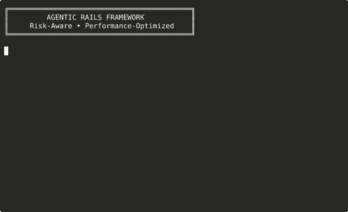

# Agentic Rails

[](https://rubyonrails.org/)
[](https://www.ruby-lang.org/)
[](https://www.postgresql.org/)
[](https://www.docker.com/)
[](https://github.com/tmux/tmux)
[](LICENSE)
[](docs/PROGRESSIVE_COMMIT_PROTOCOL_GUIDE.md)
[](.github/COMMIT_PROTOCOL.md)

> **A risk-aware, performance-optimized Rails framework that integrates terminal productivity, DevOps automation, and experiment-driven development practices.**



Agentic Rails combines wisdom from five essential books to create a comprehensive development framework that actively manages its own risks, performance, and deployment lifecycle. It implements the Progressive Commit Protocol for traceable, experiment-driven development with built-in hypothesis testing.

## Overview

Agentic Rails integrates concepts from five essential books:
- **Agile Web Development with Rails 7.2**: Modern Rails with Hotwire
- **tmux 3**: Terminal multiplexer for productivity
- **DevOps in Practice**: Continuous delivery and monitoring
- **Rails Scales**: Performance optimization techniques
- **Risk-First Software Development**: Risk management methodology

## Key Features

### 1. Risk-Aware Architecture
- Built-in risk assessment for all models
- Automatic risk scoring and mitigation suggestions
- Real-time risk monitoring via ActionCable
- Risk-based deployment decisions

### 2. Performance at Scale
- Comprehensive performance monitoring
- Automatic scaling based on metrics and risks
- Multi-tier caching strategies
- Database optimization and sharding

### 3. DevOps Integration
- Dockerized deployment
- CI/CD with GitHub Actions
- Prometheus + Grafana monitoring
- Infrastructure as Code

### 4. Developer Productivity
- tmux configurations for Rails development
- Pre-configured layouts for different workflows
- Automated testing and monitoring setups

## Demo

Run the interactive demo to see Agentic Rails in action:

```bash
# Quick demo showing risk assessment
bash demo/showcase.sh

# Or record your own demo
asciinema rec demo/my-demo.cast
bash demo/showcase.sh
# Press Ctrl+D to stop recording

# Convert to GIF
agg demo/my-demo.cast demo/my-demo.gif
```

## Quick Start

### Prerequisites
- Ruby 3.3+ (via rbenv, rvm, chruby, or asdf)
- PostgreSQL 15+
- Redis 7+
- Docker & Docker Compose
- tmux 3.4+

### Ruby Version Management

The project supports multiple Ruby version managers:

#### FreeBSD (Recommended: rbenv)
```bash
# Install rbenv and ruby-build
sudo pkg install rbenv ruby-build

# Add to shell config
echo 'eval "$(rbenv init -)"' >> ~/.bashrc
source ~/.bashrc

# Install Ruby
rbenv install 3.3.0
rbenv global 3.3.0
```

#### macOS (rbenv or rvm)
```bash
# Using Homebrew
brew install rbenv ruby-build
# Or for RVM
\curl -sSL https://get.rvm.io | bash -s stable
```

#### Linux (any manager)
All version managers work well on Linux. Choose based on preference.

### Installation

```bash
# Clone the repository
git clone https://github.com/aygp-dr/agentic-rails.git
cd agentic-rails

# Install dependencies
bundle install
yarn install

# Setup database
rails db:create db:migrate db:seed

# Start tmux development environment
tmux new-session -s agentic-rails
tmux source-file .tmux.conf
```

### Development Workflow

#### Using tmux layouts

```bash
# Development layout (editor, server, console, tests, monitoring)
tmux source-file .tmux/dev-layout.conf

# Testing layout (focused on TDD)
tmux source-file .tmux/test-layout.conf

# Monitoring layout (production-like monitoring)
tmux source-file .tmux/monitor-layout.conf
```

#### Running the application

```bash
# Start all services
docker-compose up

# Or run individually
rails server
redis-server
sidekiq

# Run tests
rails test
rails test:system
```

## Architecture

### Risk-Aware Models

```ruby
class Product < ApplicationRecord
  include RiskAware
  include PerformanceMonitored

  # Automatically tracks:
  # - Feature risks (implementation complexity)
  # - Dependency risks (external services)
  # - Model risks (data complexity)
  # - Environmental risks (security, legal)
end
```

### Performance Monitoring

```ruby
# Automatic performance tracking
Product.with_performance_tracking do
  # Complex operations monitored for:
  # - Query time
  # - Memory usage
  # - Cache performance
end
```

### Scaling Service

```ruby
# Automatic scaling based on metrics and risks
ScalingService.analyze_and_scale
# Determines strategy: horizontal, vertical, cache, or database optimization
```

## Deployment

### Production Deployment

```bash
# Build and deploy
docker build -t agentic-rails .
docker-compose -f config/deploy/docker-compose.yml up -d

# Run migrations
docker-compose exec web rails db:migrate

# Monitor deployment
docker-compose exec web rails console
> DevOps::Monitoring::MetricsCollector.start
```

### CI/CD Pipeline

GitHub Actions automatically:
1. Runs tests (unit, integration, system)
2. Performs security checks (Brakeman, bundler-audit)
3. Checks code quality (RuboCop, Rails Best Practices)
4. Runs performance benchmarks
5. Deploys to production on main branch

## Monitoring & Observability

### Metrics Dashboard

Access Grafana at `http://localhost:3001`
- Application metrics (requests, response times, errors)
- Infrastructure metrics (CPU, memory, disk, network)
- Business metrics (users, revenue, engagement)
- Risk indicators (security, compliance, stability)

### Alerts

Configured alerts for:
- High response times (>500ms)
- Low Apdex scores (<0.7)
- High error rates (>5%)
- Resource exhaustion
- Security threats
- Business KPI degradation

## Risk Management

### Risk Categories

1. **Feature Risks**: New feature impact
2. **Dependency Risks**: External service reliability
3. **Model Risks**: Data and complexity issues
4. **Environmental Risks**: Security and compliance

### Risk Mitigation

Automatic mitigations:
- Feature flags for gradual rollouts
- Circuit breakers for dependencies
- Automatic test coverage increases
- Security audit triggers

## Performance Optimization

### Caching Strategy

Multi-tier caching:
1. CDN caching for static assets
2. Redis for application cache
3. Fragment caching with Russian Dolls
4. Database query caching

### Database Optimization

- Automatic N+1 query detection
- Missing index identification
- Read replica configuration
- Horizontal sharding support

### Scaling Strategies

Automatic scaling based on:
- Request rate thresholds
- Memory and CPU usage
- Response time degradation
- Error rate increases

## Security

- Automated security scanning with Brakeman
- Dependency vulnerability checking
- Rate limiting and DDoS protection
- Encrypted secrets management
- Audit logging

## Testing

### Test Coverage

```bash
# Run all tests with coverage
COVERAGE=true rails test

# Performance benchmarks
rails test:benchmark

# System tests with headless Chrome
rails test:system
```

### Continuous Testing

Guard configuration for:
- Auto-running affected tests
- Live reload on file changes
- Performance regression detection

## Contributing

1. Fork the repository
2. Create a feature branch
3. Follow risk-aware development:
   - Assess risks before implementation
   - Include performance tests
   - Document scaling considerations
4. Submit a pull request

## License

MIT License - See LICENSE file for details

## Support

- Documentation: `/docs`
- Issues: GitHub Issues
- Slack: #agentic-rails

## Credits

Built using principles from:
- Sam Ruby - Agile Web Development with Rails
- Brian P. Hogan - tmux 3
- Danilo Sato - DevOps in Practice
- Cristian Planas - Rails Scales!
- Rob Moffat - Risk-First Software Development