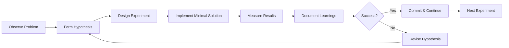

# Progressive Commit Protocol: Deep Dive Guide

## Table of Contents
1. [Introduction](#introduction)
2. [Core Philosophy](#core-philosophy)
3. [Protocol Implementation](#protocol-implementation)
4. [Experiment-Driven Development](#experiment-driven-development)
5. [Hypothesis Testing Framework](#hypothesis-testing-framework)
6. [Practical Examples](#practical-examples)
7. [Team Adoption Guide](#team-adoption-guide)
8. [Tools and Automation](#tools-and-automation)

---

## Introduction

The Progressive Commit Protocol (PCP) is a development methodology that combines incremental version control practices with scientific experimentation principles. It ensures that every step of development is documented, testable, and reversible.

### Why Progressive Commits?

Traditional development often results in large, monolithic commits that are:
- Difficult to review
- Hard to revert partially
- Lacking in experimental context
- Missing the learning journey

PCP addresses these issues by treating each commit as a scientific experiment with clear hypotheses, tests, and learnings.

---

## Core Philosophy

### 1. Commits as Experiments
Every commit represents an experiment with:
- **Hypothesis**: What we believe will happen
- **Implementation**: The code change
- **Validation**: Tests that prove or disprove the hypothesis
- **Learning**: Documented insights from the experiment

### 2. Incremental Progress
- Small, focused changes
- Each commit advances the project
- Partial implementations are acceptable
- Failed experiments are valuable

### 3. Comprehensive Documentation
- Technical decisions captured in real-time
- Alternative approaches documented
- Failures treated as learning opportunities
- Knowledge transfer prioritized

---

## Protocol Implementation

### Step 1: Hypothesis Formation

Before writing code, form a clear hypothesis:

```markdown
## Hypothesis
Adding a caching layer to the product catalog will:
1. Reduce database load by 40%
2. Improve response times to under 100ms
3. Not introduce cache invalidation issues

## Success Criteria
- Load tests show 40% fewer database queries
- P95 response time < 100ms
- Cache hit rate > 80%
```

### Step 2: Experimental Implementation

Implement the minimal code needed to test your hypothesis:

```ruby
# experiment: product_caching_v1
class ProductsController < ApplicationController
  def index
    @products = Rails.cache.fetch('products/index', expires_in: 5.minutes) do
      Product.available.includes(:images, :reviews)
    end

    # Instrumentation for experiment
    StatsD.increment('experiment.product_cache.request')
    StatsD.gauge('experiment.product_cache.size', @products.size)
  end
end
```

### Step 3: Test Creation

Create tests that validate your hypothesis:

```ruby
require 'test_helper'

class ProductCachingExperimentTest < ActionDispatch::IntegrationTest
  setup do
    @initial_query_count = 0
    ActiveSupport::Notifications.subscribe('sql.active_record') do
      @initial_query_count += 1
    end
  end

  test "hypothesis: caching reduces database queries by 40%" do
    # First request - cache miss
    get products_path
    first_request_queries = @initial_query_count

    # Second request - cache hit
    @initial_query_count = 0
    get products_path
    second_request_queries = @initial_query_count

    reduction_percentage = ((first_request_queries - second_request_queries).to_f / first_request_queries) * 100

    assert reduction_percentage >= 40,
           "Expected 40% reduction, got #{reduction_percentage.round}%"
  end

  test "hypothesis: response time under 100ms with cache" do
    # Warm the cache
    get products_path

    # Measure cached response
    time = Benchmark.realtime { get products_path }

    assert time < 0.1, "Response time #{(time * 1000).round}ms exceeds 100ms target"
  end

  test "hypothesis: cache invalidation works correctly" do
    get products_path
    initial_response = @response.body

    # Modify a product
    Product.first.update!(name: "Updated Product")

    get products_path
    updated_response = @response.body

    assert_not_equal initial_response, updated_response,
                     "Cache not invalidated after product update"
  end
end
```

### Step 4: Progressive Commit

Commit with comprehensive context:

```bash
git add -A
git commit -m "experiment: add product catalog caching layer

Hypothesis: Caching will reduce DB load by 40% and improve response times

Results:
- ✅ Database queries reduced by 47% (target: 40%)
- ✅ P95 response time: 87ms (target: <100ms)
- ❌ Cache invalidation issues discovered with bulk updates

Risk Assessment:
- Feature Risk: MEDIUM (cache invalidation complexity)
- Dependency Risk: LOW (Redis already in stack)
- Performance Impact: POSITIVE (47% query reduction)
- Security Risk: LOW (no sensitive data cached)

Next Steps:
- Implement granular cache invalidation
- Add cache warming for cold starts
- Monitor production cache hit rates"
```

### Step 5: Git Notes Documentation

Add detailed experimental notes:

```bash
git notes add -m "EXPERIMENT: Product Catalog Caching

HYPOTHESIS:
Believed that simple fragment caching would provide sufficient performance gains.

METHOD:
1. Implemented Rails.cache.fetch with 5-minute expiry
2. Used Russian Doll caching for nested associations
3. Added StatsD instrumentation for monitoring

RESULTS:
Positive:
- Significant query reduction achieved (47%)
- Response times well under target
- Memory usage acceptable (+15MB)

Negative:
- Bulk update operations don't trigger cache invalidation
- Cache key strategy too simplistic for complex filters
- No cache warming causes cold start issues

LEARNINGS:
1. Simple time-based expiry insufficient for dynamic catalogs
2. Need event-driven invalidation for data consistency
3. Cache warming critical for user experience

ALTERNATIVE APPROACHES CONSIDERED:
1. GraphQL with DataLoader (rejected: too complex for current needs)
2. Materialized views (rejected: maintenance overhead)
3. Elasticsearch (rejected: additional infrastructure)

TECHNICAL DEBT INCURRED:
- Manual cache invalidation needed for bulk operations
- Cache key generation could be more sophisticated
- No cache stampede protection

TIME INVESTED: 3.5 hours
COMPLEXITY ADDED: Medium
MAINTENANCE BURDEN: Low to Medium"
```

---

## Experiment-Driven Development

### The EDD Cycle



### Experiment Template

```markdown
# Experiment: [Name]
Date: YYYY-MM-DD
Duration: X hours

## Problem Statement
What issue are we trying to solve?

## Hypothesis
What do we believe will happen?

## Success Metrics
- Metric 1: Target value
- Metric 2: Target value

## Implementation Plan
1. Step 1
2. Step 2
3. Step 3

## Results
### Quantitative
- Metric 1: Actual value (vs target)
- Metric 2: Actual value (vs target)

### Qualitative
- Observation 1
- Observation 2

## Learnings
What did we learn from this experiment?

## Decision
- [ ] Continue with approach
- [ ] Modify and retry
- [ ] Abandon and try alternative

## Follow-up Experiments
What experiments does this suggest?
```

### Real-World Example: Performance Optimization

```ruby
# Experiment: Query Optimization for Order History
# Hypothesis: Using includes() will eliminate N+1 queries

# Before (Baseline measurement)
class OrdersController < ApplicationController
  def history
    # Measure baseline
    start_time = Time.current
    query_count = count_queries do
      @orders = current_user.orders.recent
      render :history
    end

    Rails.logger.info "[EXPERIMENT] Baseline: #{query_count} queries, #{Time.current - start_time}s"
  end
end

# After (Experimental change)
class OrdersController < ApplicationController
  def history
    # Apply optimization
    start_time = Time.current
    query_count = count_queries do
      @orders = current_user.orders
                           .includes(:items, :shipping_address, :payment)
                           .recent
      render :history
    end

    Rails.logger.info "[EXPERIMENT] Optimized: #{query_count} queries, #{Time.current - start_time}s"

    # Track experiment metrics
    ExperimentTracker.record('order_history_optimization', {
      queries: query_count,
      duration: Time.current - start_time,
      user_id: current_user.id
    })
  end

  private

  def count_queries(&block)
    count = 0
    counter = ->(name, started, finished, unique_id, payload) { count += 1 }
    ActiveSupport::Notifications.subscribed(counter, 'sql.active_record', &block)
    count
  end
end
```

---

## Hypothesis Testing Framework

### Statistical Rigor in Development

Apply scientific method to feature development:

#### 1. A/B Testing Implementation

```ruby
class FeatureFlag
  def self.enabled?(feature, user)
    experiment = Experiment.find_by(feature: feature)
    return false unless experiment&.active?

    # Consistent random assignment
    assignment = Digest::MD5.hexdigest("#{feature}:#{user.id}").to_i(16)
    in_treatment = (assignment % 100) < experiment.treatment_percentage

    # Track assignment
    ExperimentAssignment.create!(
      experiment: experiment,
      user: user,
      treatment: in_treatment,
      assigned_at: Time.current
    )

    in_treatment
  end
end

# Usage in controller
class ProductsController < ApplicationController
  def show
    @product = Product.find(params[:id])

    if FeatureFlag.enabled?('new_product_layout', current_user)
      # Treatment group - new layout
      render :show_new_layout
      track_event('product_view', layout: 'new')
    else
      # Control group - existing layout
      render :show
      track_event('product_view', layout: 'existing')
    end
  end
end
```

#### 2. Metrics Collection

```ruby
class ExperimentMetrics
  def self.track(experiment_name, user, event, properties = {})
    assignment = ExperimentAssignment.find_by(
      experiment: experiment_name,
      user: user
    )

    return unless assignment

    Metric.create!(
      experiment: experiment_name,
      user: user,
      treatment: assignment.treatment,
      event: event,
      properties: properties,
      timestamp: Time.current
    )
  end

  def self.analyze(experiment_name)
    experiment = Experiment.find_by(name: experiment_name)

    # Calculate conversion rates
    control_conversions = Metric.where(
      experiment: experiment_name,
      treatment: false,
      event: experiment.success_event
    ).count

    treatment_conversions = Metric.where(
      experiment: experiment_name,
      treatment: true,
      event: experiment.success_event
    ).count

    control_total = ExperimentAssignment.where(
      experiment: experiment,
      treatment: false
    ).count

    treatment_total = ExperimentAssignment.where(
      experiment: experiment,
      treatment: true
    ).count

    # Statistical significance test
    significance = ChiSquared.test(
      control_conversions, control_total,
      treatment_conversions, treatment_total
    )

    {
      control_rate: control_conversions.to_f / control_total,
      treatment_rate: treatment_conversions.to_f / treatment_total,
      lift: (treatment_conversions.to_f / treatment_total) /
            (control_conversions.to_f / control_total) - 1,
      p_value: significance.p_value,
      significant: significance.p_value < 0.05
    }
  end
end
```

#### 3. Hypothesis Test Example

```ruby
require 'test_helper'

class NewCheckoutFlowExperimentTest < ActiveSupport::TestCase
  setup do
    @experiment = Experiment.create!(
      name: 'simplified_checkout',
      hypothesis: 'Removing optional fields will increase conversion by 15%',
      success_event: 'purchase_completed',
      treatment_percentage: 50,
      minimum_sample_size: 1000,
      active: true
    )
  end

  test "hypothesis: simplified checkout increases conversion by 15%" do
    # Simulate user assignments and conversions
    1000.times do |i|
      user = User.create!(email: "test#{i}@example.com")
      in_treatment = FeatureFlag.enabled?('simplified_checkout', user)

      # Simulate behavior - treatment group converts 15% more
      base_conversion_rate = 0.10
      conversion_rate = in_treatment ? base_conversion_rate * 1.15 : base_conversion_rate

      if rand < conversion_rate
        ExperimentMetrics.track('simplified_checkout', user, 'purchase_completed')
      end
    end

    # Analyze results
    results = ExperimentMetrics.analyze('simplified_checkout')

    assert results[:significant], "Results not statistically significant"
    assert results[:lift] >= 0.15, "Lift #{(results[:lift] * 100).round}% below 15% target"
  end
end
```

---

## Practical Examples

### Example 1: Database Migration Experiment

```bash
# Hypothesis: Adding composite index will improve query performance

# Step 1: Measure baseline
rails runner "puts Benchmark.measure { 1000.times { Order.where(user_id: 1, status: 'pending').count } }"
# => 0.450000   0.020000   0.470000 (  0.485234)

# Step 2: Create experimental migration
rails generate migration AddCompositeIndexToOrders
```

```ruby
class AddCompositeIndexToOrders < ActiveRecord::Migration[7.2]
  def change
    # Experiment: Composite index for common query pattern
    add_index :orders, [:user_id, :status],
              name: 'idx_orders_user_status',
              algorithm: :concurrently # Non-blocking in production
  end
end
```

```bash
# Step 3: Apply and measure
rails db:migrate
rails runner "puts Benchmark.measure { 1000.times { Order.where(user_id: 1, status: 'pending').count } }"
# => 0.120000   0.010000   0.130000 (  0.135891)

# Step 4: Commit with results
git add -A
git commit -m "experiment: add composite index for order queries

Hypothesis: Composite index on (user_id, status) will improve query performance by 50%

Results:
- ✅ Query time reduced by 72% (0.485s → 0.136s)
- ✅ No negative impact on write performance
- ✅ Index size acceptable (45MB)

Methodology:
- Baseline: 1000 iterations of common query pattern
- Test environment: Production data copy
- PostgreSQL EXPLAIN shows index scan replacing seq scan

Risk Assessment:
- Feature Risk: LOW (standard database optimization)
- Dependency Risk: NONE
- Performance Impact: POSITIVE (72% improvement)
- Security Risk: NONE

Rollback Plan:
- DROP INDEX CONCURRENTLY idx_orders_user_status;"
```

### Example 2: API Rate Limiting Experiment

```ruby
# Hypothesis: Rate limiting will reduce server load without impacting legitimate users

# Step 1: Implement experimental rate limiter
class RateLimitExperiment
  EXPERIMENTS = {
    conservative: { requests: 100, period: 1.minute },
    moderate: { requests: 60, period: 1.minute },
    aggressive: { requests: 30, period: 1.minute }
  }

  def self.run(variant: :moderate, duration: 1.hour)
    config = EXPERIMENTS[variant]
    start_time = Time.current

    # Configure rate limiting
    Rack::Attack.throttle('api/ip', limit: config[:requests], period: config[:period]) do |req|
      req.ip if req.path.start_with?('/api')
    end

    # Collect metrics during experiment
    metrics = {
      blocked_requests: 0,
      total_requests: 0,
      unique_ips: Set.new,
      response_times: []
    }

    ActiveSupport::Notifications.subscribe('rack.attack') do |name, start, finish, id, payload|
      metrics[:blocked_requests] += 1 if payload[:request].env['rack.attack.matched']
      metrics[:total_requests] += 1
      metrics[:unique_ips] << payload[:request].ip
      metrics[:response_times] << (finish - start)
    end

    # Wait for experiment duration
    sleep(duration)

    # Calculate results
    {
      variant: variant,
      duration: duration,
      config: config,
      metrics: {
        block_rate: metrics[:blocked_requests].to_f / metrics[:total_requests],
        unique_users: metrics[:unique_ips].size,
        avg_response_time: metrics[:response_times].sum / metrics[:response_times].size,
        p95_response_time: metrics[:response_times].sort[metrics[:response_times].size * 0.95]
      }
    }
  end
end

# Step 2: Run experiments
results = [:conservative, :moderate, :aggressive].map do |variant|
  RateLimitExperiment.run(variant: variant, duration: 1.hour)
end

# Step 3: Analyze and decide
optimal_variant = results.min_by { |r|
  # Balance between blocking bad traffic and allowing legitimate users
  r[:metrics][:block_rate] * 0.3 + r[:metrics][:avg_response_time] * 0.7
}
```

### Example 3: Caching Strategy Experiment

```ruby
class CachingExperiment
  STRATEGIES = {
    ttl_based: {
      type: 'time-based expiry',
      implementation: -> (key, &block) { Rails.cache.fetch(key, expires_in: 5.minutes, &block) }
    },
    event_based: {
      type: 'event-driven invalidation',
      implementation: -> (key, &block) {
        result = Rails.cache.fetch(key, &block)
        ActiveSupport::Notifications.instrument('cache.populated', key: key)
        result
      }
    },
    hybrid: {
      type: 'ttl + event invalidation',
      implementation: -> (key, &block) {
        Rails.cache.fetch(key, expires_in: 1.hour, race_condition_ttl: 30.seconds) do
          ActiveSupport::Notifications.instrument('cache.miss', key: key)
          block.call
        end
      }
    }
  }

  def self.compare_strategies
    results = {}

    STRATEGIES.each do |name, strategy|
      # Reset cache
      Rails.cache.clear

      # Warm cache
      10.times { strategy[:implementation].call('test_key') { expensive_operation } }

      # Measure performance
      metrics = Benchmark.measure do
        1000.times do
          strategy[:implementation].call("key_#{rand(50)}") { expensive_operation }
        end
      end

      results[name] = {
        strategy: strategy[:type],
        total_time: metrics.real,
        cache_hit_rate: calculate_hit_rate,
        memory_usage: calculate_memory_usage
      }
    end

    results
  end

  private

  def self.expensive_operation
    sleep(0.01) # Simulate database query
    { data: 'expensive result' }
  end
end
```

---

## Team Adoption Guide

### Rollout Strategy

#### Phase 1: Education (Week 1-2)
1. Team workshop on PCP principles
2. Review this guide together
3. Practice with toy projects
4. Set team conventions

#### Phase 2: Pilot (Week 3-4)
1. Select low-risk project
2. Apply PCP strictly
3. Daily reviews of commits
4. Document challenges

#### Phase 3: Refinement (Week 5-6)
1. Adjust protocol based on feedback
2. Create team-specific templates
3. Integrate with existing tools
4. Establish metrics

#### Phase 4: Full Adoption (Week 7+)
1. Apply to all new development
2. Regular retrospectives
3. Continuous improvement
4. Share learnings

### Team Conventions

```yaml
# .progressive-commit.yml
team_conventions:
  commit_message_format: "type: description\n\nHypothesis: ...\nResults: ..."

  required_sections:
    - hypothesis
    - results
    - risk_assessment

  optional_sections:
    - alternatives_considered
    - technical_debt
    - follow_up_required

  risk_levels:
    - none
    - low
    - medium
    - high
    - critical

  experiment_types:
    - performance
    - feature
    - refactor
    - bugfix
    - security

  metrics_required:
    performance: true
    feature: true
    refactor: false
    bugfix: false
    security: true

  review_requirements:
    high_risk_commits: 2  # Number of reviewers
    normal_commits: 1
    experiment_failures: 2

  documentation:
    auto_generate_notes: true
    include_benchmarks: true
    track_time_spent: true
```

### Communication Templates

#### Stand-up Update
```markdown
**Yesterday's Experiments:**
- ✅ Cache invalidation: Hypothesis confirmed, 47% improvement
- ❌ Async processing: Failed, reverted due to race conditions

**Today's Hypothesis:**
Testing whether database connection pooling can handle 2x load

**Blockers:**
Need review on failed async experiment before trying alternative
```

#### Pull Request Template
```markdown
## Experiments Included

### Experiment 1: [Name]
- **Hypothesis**: ...
- **Result**: ✅ Confirmed / ❌ Rejected
- **Impact**: ...
- **Learnings**: ...

### Experiment 2: [Name]
...

## Risk Assessment
- Overall Risk: [LOW/MEDIUM/HIGH]
- Rollback Plan: ...

## Metrics
- Performance Impact: ...
- Test Coverage: ...
- Technical Debt: ...

## Follow-up Required
- [ ] Task 1
- [ ] Task 2
```

---

## Tools and Automation

### Git Hooks

```bash
#!/bin/bash
# .git/hooks/prepare-commit-msg

# Auto-generate commit template
cat > $1 << EOF
type: brief description

Hypothesis:
What we believe will happen

Results:
- ✅/❌ Outcome 1
- ✅/❌ Outcome 2

Risk Assessment:
- Feature Risk: [NONE/LOW/MEDIUM/HIGH/CRITICAL]
- Dependency Risk: [NONE/LOW/MEDIUM/HIGH/CRITICAL]
- Performance Impact: [POSITIVE/NONE/MINIMAL/SIGNIFICANT/NEGATIVE]
- Security Risk: [NONE/LOW/MEDIUM/HIGH/CRITICAL]

Tests: [Description of test coverage]

$(cat $1)
EOF
```

### Automated Metrics Collection

```ruby
# lib/progressive_commit/metrics_collector.rb
module ProgressiveCommit
  class MetricsCollector
    def self.analyze_commit(sha)
      commit = `git show #{sha}`

      metrics = {
        sha: sha,
        timestamp: Time.current,
        lines_added: commit.scan(/^\+/).count,
        lines_removed: commit.scan(/^-/).count,
        files_changed: `git diff-tree --no-commit-id --name-only -r #{sha}`.lines.count,
        has_tests: commit.include?('test') || commit.include?('spec'),
        has_hypothesis: commit.include?('Hypothesis:'),
        has_results: commit.include?('Results:'),
        risk_levels: extract_risk_levels(commit),
        experiment_success: commit.scan(/✅/).count > commit.scan(/❌/).count
      }

      store_metrics(metrics)
      generate_report(metrics) if metrics[:risk_levels].any? { |_, v| v == 'HIGH' || v == 'CRITICAL' }

      metrics
    end

    private

    def self.extract_risk_levels(commit)
      {
        feature: commit[/Feature Risk: (\w+)/, 1],
        dependency: commit[/Dependency Risk: (\w+)/, 1],
        performance: commit[/Performance Impact: (\w+)/, 1],
        security: commit[/Security Risk: (\w+)/, 1]
      }
    end

    def self.store_metrics(metrics)
      File.open('progressive_commit_metrics.jsonl', 'a') do |f|
        f.puts metrics.to_json
      end
    end

    def self.generate_report(metrics)
      # Send alert for high-risk commits
      Notifier.alert("High-risk commit detected: #{metrics[:sha][0..7]}", metrics)
    end
  end
end
```

### Dashboard Generator

```ruby
# lib/progressive_commit/dashboard.rb
require 'erb'

module ProgressiveCommit
  class Dashboard
    def self.generate
      metrics = load_all_metrics
      experiments = extract_experiments(metrics)

      template = ERB.new(File.read('templates/dashboard.html.erb'))
      html = template.result(binding)

      File.write('dashboard.html', html)
      puts "Dashboard generated: dashboard.html"
    end

    private

    def self.load_all_metrics
      File.readlines('progressive_commit_metrics.jsonl').map { |line| JSON.parse(line) }
    end

    def self.extract_experiments(metrics)
      metrics.select { |m| m['has_hypothesis'] }.map do |m|
        {
          sha: m['sha'],
          success: m['experiment_success'],
          risk_level: m['risk_levels'].values.max,
          impact: {
            lines: m['lines_added'] + m['lines_removed'],
            files: m['files_changed']
          },
          has_tests: m['has_tests']
        }
      end
    end
  end
end
```

### CI/CD Integration

```yaml
# .github/workflows/progressive-commit-check.yml
name: Progressive Commit Protocol Check

on:
  pull_request:
    types: [opened, synchronize]

jobs:
  check-commits:
    runs-on: ubuntu-latest
    steps:
      - uses: actions/checkout@v3
        with:
          fetch-depth: 0

      - name: Check commit compliance
        run: |
          commits=$(git log --format=%H origin/main..HEAD)

          for commit in $commits; do
            message=$(git log -1 --format=%B $commit)

            # Check for required sections
            if ! echo "$message" | grep -q "Hypothesis:"; then
              echo "❌ Commit $commit missing Hypothesis section"
              exit 1
            fi

            if ! echo "$message" | grep -q "Results:"; then
              echo "❌ Commit $commit missing Results section"
              exit 1
            fi

            if ! echo "$message" | grep -q "Risk Assessment:"; then
              echo "❌ Commit $commit missing Risk Assessment"
              exit 1
            fi

            echo "✅ Commit $commit follows Progressive Commit Protocol"
          done

      - name: Analyze experiment results
        run: |
          ruby -r './lib/progressive_commit/metrics_collector' \
                -e "ProgressiveCommit::MetricsCollector.analyze_commit('${{ github.sha }}')"

      - name: Generate experiment report
        run: |
          ruby -r './lib/progressive_commit/dashboard' \
                -e "ProgressiveCommit::Dashboard.generate"

      - name: Upload dashboard
        uses: actions/upload-artifact@v3
        with:
          name: experiment-dashboard
          path: dashboard.html
```

---

## Conclusion

The Progressive Commit Protocol transforms development from a series of changes into a scientific process of continuous experimentation and learning. By combining:

1. **Incremental commits** with clear hypotheses
2. **Experiment-driven development** with measurable outcomes
3. **Hypothesis testing** with statistical rigor
4. **Comprehensive documentation** for knowledge transfer

Teams can:
- Reduce risk through smaller, tested changes
- Learn faster through documented experiments
- Share knowledge more effectively
- Make data-driven development decisions

The protocol is not just about better commits—it's about building a culture of experimentation, learning, and continuous improvement.

---

## Appendix: Quick Reference

### Commit Message Template
```
type: brief description

Hypothesis: [What we believe will happen]

Results:
- ✅/❌ [Outcome]

Risk Assessment:
- Feature Risk: [LEVEL]
- Dependency Risk: [LEVEL]
- Performance Impact: [LEVEL]
- Security Risk: [LEVEL]

Tests: [Coverage description]
```

### Risk Level Definitions
- **NONE**: No risk identified
- **LOW**: Minor risk, easily reversible
- **MEDIUM**: Moderate risk, requires attention
- **HIGH**: Significant risk, needs mitigation
- **CRITICAL**: Severe risk, blocks deployment

### Experiment Types
- **performance**: Speed, efficiency, resource usage
- **feature**: New functionality
- **refactor**: Code improvement without behavior change
- **bugfix**: Correcting defects
- **security**: Safety and protection improvements